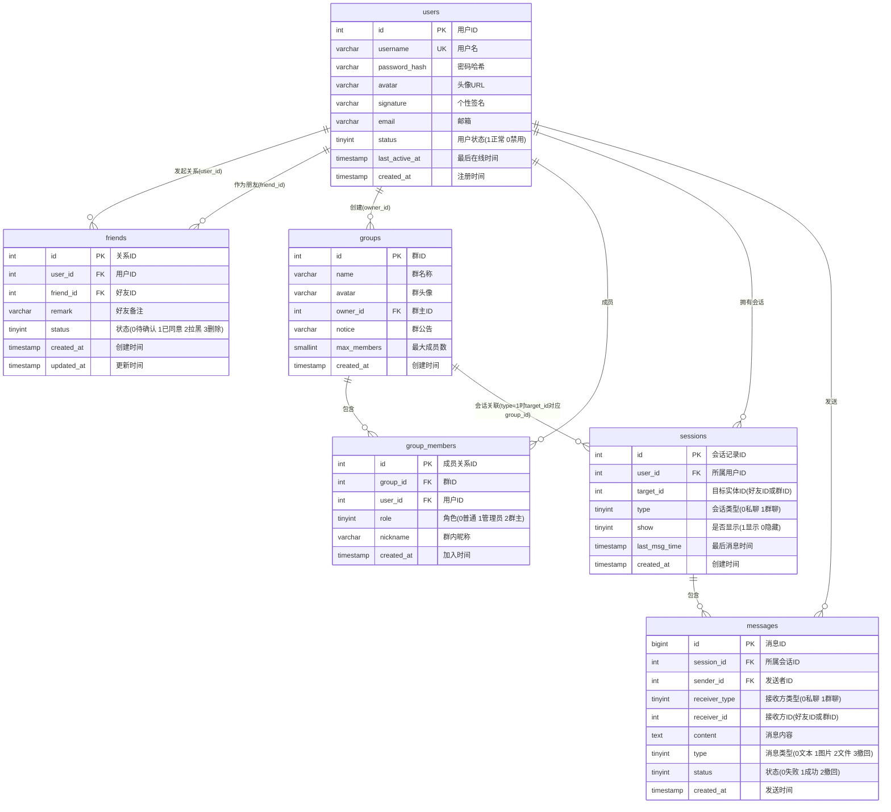

# ai-vue-im

### 数据模型

```mermaid
erDiagram
    users {
        int id PK "用户ID"
        varchar username UK "用户名"
        varchar password_hash "密码哈希"
        varchar avatar "头像URL"
        varchar signature "个性签名"
        varchar email "邮箱"
        tinyint status "用户状态(1正常 0禁用)"
        timestamp last_active_at "最后在线时间"
        timestamp created_at "注册时间"
    }

    friends {
        int id PK "关系ID"
        int user_id FK "用户ID"
        int friend_id FK "好友ID"
        varchar remark "好友备注"
        tinyint status "状态(0待确认 1已同意 2拉黑 3删除)"
        timestamp created_at "创建时间"
        timestamp updated_at "更新时间"
    }

    groups {
        int id PK "群ID"
        varchar name "群名称"
        varchar avatar "群头像"
        int owner_id FK "群主ID"
        varchar notice "群公告"
        smallint max_members "最大成员数"
        timestamp created_at "创建时间"
    }

    group_members {
        int id PK "成员关系ID"
        int group_id FK "群ID"
        int user_id FK "用户ID"
        tinyint role "角色(0普通 1管理员 2群主)"
        varchar nickname "群内昵称"
        timestamp created_at "加入时间"
    }

    sessions {
        int id PK "会话记录ID"
        int user_id FK "所属用户ID"
        int target_id "目标实体ID(好友ID或群ID)"
        tinyint type "会话类型(0私聊 1群聊)"
        tinyint show "是否显示(1显示 0隐藏)"
        timestamp last_msg_time "最后消息时间"
        timestamp created_at "创建时间"
    }

    messages {
        bigint id PK "消息ID"
        int session_id FK "所属会话ID"
        int sender_id FK "发送者ID"
        tinyint receiver_type "接收方类型(0私聊 1群聊)"
        int receiver_id "接收方ID(好友ID或群ID)"
        text content "消息内容"
        tinyint type "消息类型(0文本 1图片 2文件 3撤回)"
        tinyint status "状态(0失败 1成功 2撤回)"
        timestamp created_at "发送时间"
    }

    users ||--o{ friends : "发起关系(user_id)"
    users ||--o{ friends : "作为朋友(friend_id)"
    users ||--o{ groups : "创建(owner_id)"
    users ||--o{ group_members : "成员"
    users ||--o{ sessions : "拥有会话"
    users ||--o{ messages : "发送"
    groups ||--o{ group_members : "包含"
    groups ||--o{ sessions : "会话关联(type=1时target_id对应group_id)"
    sessions ||--o{ messages : "包含"
```
